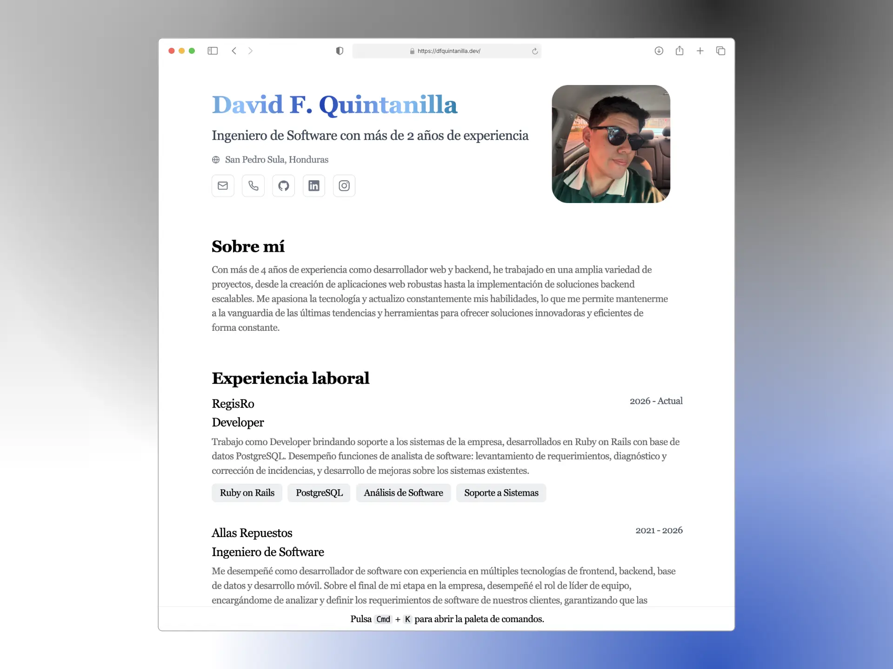

<div align="center">

<h2>Portafolio y CV de David F. Quintanilla</h2>

<p>
Portafolio imprimible generado a partir de un único <code>cv.json</code>, siguiendo el esquema de
<a href="https://jsonresume.org/schema/">jsonresume.org</a>.
</p>

<p>
<a href="https://dfquintanilla.dev"><b>dfquintanilla.dev</b></a>
</p>

<p>


</p>



</div>

---

## ✨ Características

- **Una sola fuente de verdad**: todo el contenido vive en [`cv.json`](cv.json). No hay texto quemado en los componentes.
- **Páginas de detalle por proyecto** en `/proyectos/{id}`, con descripción extendida, tecnologías, capturas y breadcrumbs.
- **SEO completo**: canonical, Open Graph, Twitter Cards, JSON-LD (`Person`, `WebSite`, `ProfilePage`, `WebApplication`, `BreadcrumbList`), `sitemap-index.xml` y `robots.txt`.
- **Imágenes sociales generadas**: una tarjeta Open Graph de 1200×630 para la home y una por cada proyecto.
- **Versión imprimible**: `Ctrl/Cmd + P` produce un CV en papel, ocultando lo que sobra (`.no-print` / `.print`).
- **Atajos de teclado** con [Ninja Keys](https://github.com/ssleptsov/ninja-keys) para saltar a los perfiles sociales.
- **PWA-ready**: `site.webmanifest`, iconos de 192/512 px, apple-touch-icon y favicon `.ico` + `.svg`.

## 🛠️ Stack

- [**Astro**](https://astro.build/) — generación estática, cero JS por defecto.
- [**TypeScript**](https://www.typescriptlang.org/) — el esquema del CV está tipado en [`src/cv.d.ts`](src/cv.d.ts).
- [**Tailwind CSS**](https://tailwindcss.com/) — estilos utilitarios.
- [**Ninja Keys**](https://github.com/ssleptsov/ninja-keys) — paleta de comandos con atajos.
- [**sharp**](https://sharp.pixelplumbing.com/) — generación de las imágenes OG y los iconos.

## 🚀 Empezar

```bash
npm install
```

```bash
npm run dev
```

Abrí [**http://localhost:4321**](http://localhost:4321/) para ver el resultado.

## 🧞 Comandos

|     | Comando         | Acción                                                             |
| :-- | :-------------- | :----------------------------------------------------------------- |
| ⚙️  | `dev` o `start` | Servidor de desarrollo en `localhost:4321`.                        |
| ⚙️  | `build`         | Corre `astro check` y empaqueta a `./dist/`.                       |
| ⚙️  | `preview`       | Vista previa local del build de producción.                        |
| 🖼️  | `og`            | Regenera las imágenes Open Graph y los iconos dentro de `public/`. |

## 📁 Estructura

```
cv.json                        # Todo el contenido del CV y el portafolio
scripts/generate-og.mjs        # Genera public/og/*.png y los iconos del sitio
src/
  consts.ts                    # Dominio canónico, keywords y helpers de SEO
  schema.ts                    # Constructores de los fragmentos JSON-LD
  cv.d.ts                      # Tipos del esquema de cv.json
  components/
    Seo.astro                  # <head>: meta, Open Graph, Twitter, JSON-LD
    Section.astro
    sections/                  # Hero, About, Experience, Projects, Skills…
  layouts/Layout.astro
  pages/
    index.astro                # Home
    404.astro
    proyectos/[id].astro       # Detalle de proyecto
public/
  og/                          # Tarjetas sociales generadas
  projects-screenshots/        # Capturas de los proyectos (ver abajo)
  skills-logos/                # Logos de tecnologías
```

## ✏️ Editar el contenido

Todo se edita en [`cv.json`](cv.json). Los campos siguen el esquema de JSON Resume, con algunas extensiones propias:

| Campo                            | Para qué sirve                                                               |
| :------------------------------- | :--------------------------------------------------------------------------- |
| `certificatesUrl`                | Link a la hoja con la lista completa de cursos.                              |
| `certificates[].featured`        | `true` muestra el certificado de entrada; `false` lo deja tras el "Ver más". |
| `certificates[].category`        | Categoría que se muestra como etiqueta en la tarjeta.                        |
| `projects[].id`                  | Activa la página de detalle en `/proyectos/{id}`.                            |
| `projects[].longDescription`     | Párrafos de la página de detalle.                                            |
| `projects[].skills`              | Tecnologías con su logo (`image: null` si no hay logo).                      |
| `projects[].links`               | Varios enlaces para un mismo proyecto (app, sitio web, repo…).               |
| `projects[].applicationCategory` | Valor de schema.org para los datos estructurados.                            |
| `skills[].image`                 | Ruta al logo dentro de `public/skills-logos/`.                               |

### Capturas de proyectos

Los proyectos con `id` muestran tres capturas. Se colocan en `public/projects-screenshots/` con el formato `{id}-01.webp`, `{id}-02.webp` y `{id}-03.webp`:

| Proyecto                      | ID                    |
| :---------------------------- | :-------------------- |
| Página Web de Allas Repuestos | `allas-repuestos-web` |
| Wake Health                   | `wake-health`         |
| Palette Wizard                | `palette-wizard`      |
| Memorder                      | `memorder`            |

Mientras falte un archivo, la página muestra un marcador con el nombre exacto que espera. La detección ocurre en tiempo de build, así que hay que volver a compilar después de subirlas.

## 🔍 SEO

El `<head>` completo se arma en [`src/components/Seo.astro`](src/components/Seo.astro) y los datos estructurados en [`src/schema.ts`](src/schema.ts). Ambos leen de `cv.json`, así que **actualizar el CV actualiza el SEO**.

El dominio se define en `basics.url` dentro de `cv.json`: de ahí salen el canonical, las URLs absolutas de las imágenes sociales, el `sitemap`, los `@id` del JSON-LD y el pie de las tarjetas Open Graph. La única excepción es la línea `Sitemap:` de [`public/robots.txt`](public/robots.txt), que es un archivo estático y hay que editar a mano.

### Regenerar las imágenes sociales

```bash
npm run og
```

Genera `public/og/default.png`, una tarjeta por proyecto con `id`, los iconos PWA y el favicon. El resultado se versiona en el repo, así que el build de Astro no depende de `sharp`. Conviene correrlo cada vez que cambien el nombre, el titular o los proyectos.

### Después de publicar

1. Dar de alta el sitio en [Google Search Console](https://search.google.com/search-console) y enviar `https://dfquintanilla.dev/sitemap-index.xml`.
2. Validar los datos estructurados en la [prueba de resultados enriquecidos](https://search.google.com/test/rich-results).
3. Revisar cómo se ven las previsualizaciones en el [depurador de LinkedIn](https://www.linkedin.com/post-inspector/) y en el [de Facebook](https://developers.facebook.com/tools/debug/).

## 🔑 Licencia

[MIT](LICENSE.txt) — plantilla original de [**midudev**](https://midu.dev), adaptada por [**fq962**](https://dfquintanilla.dev).
